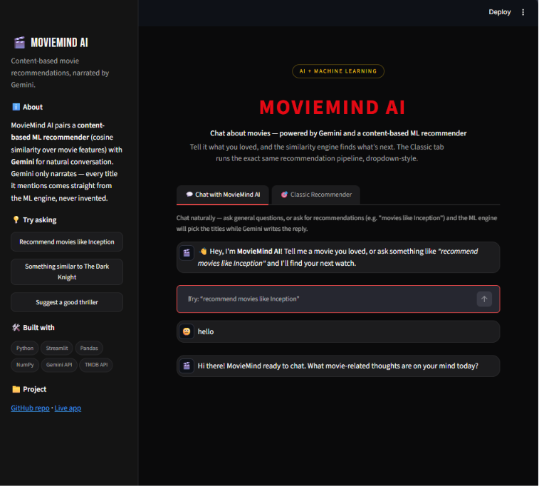
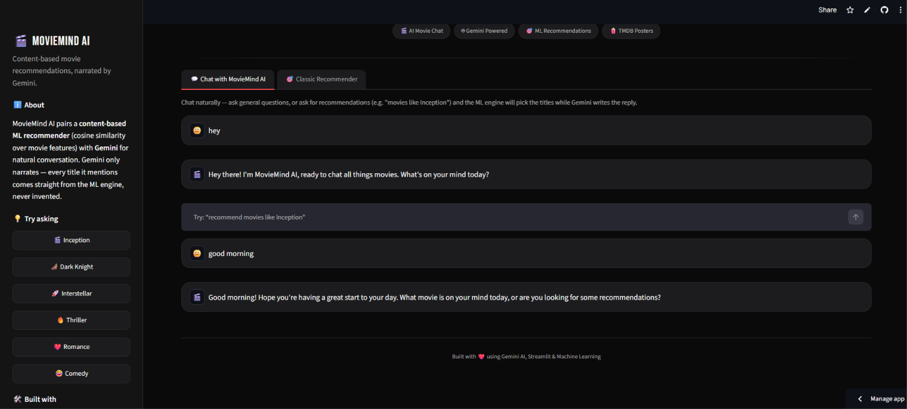
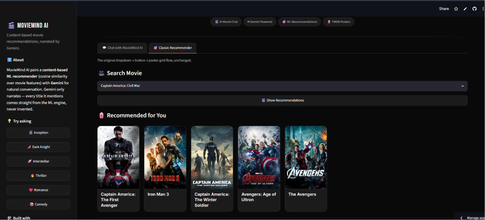
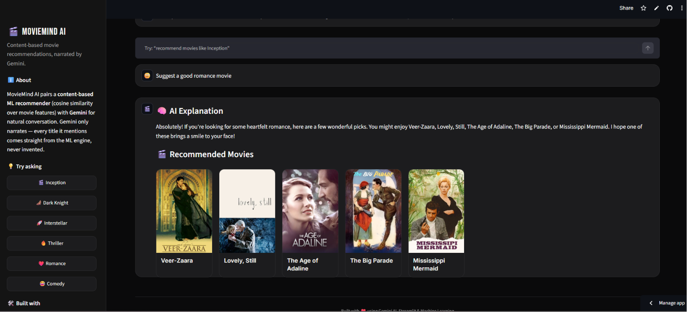
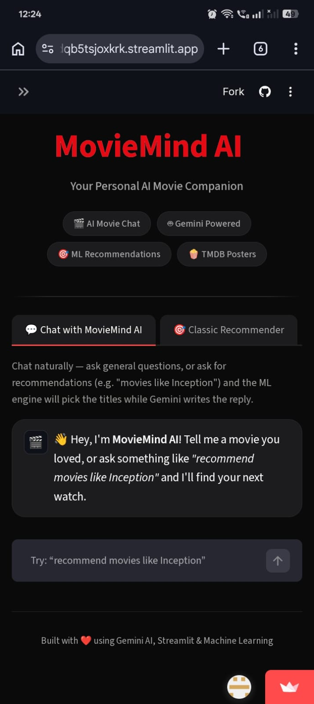

# 🎬 MovieMind AI

> **Your Personal AI Movie Companion** 🤖🍿

MovieMind AI is an intelligent movie recommendation system that combines **Machine Learning** with **Generative AI** to deliver personalized movie suggestions through natural conversations.

Unlike traditional recommendation systems that only return similar movies, MovieMind AI acts as an AI-powered movie assistant. Users can ask for recommendations in natural language, explore genres, and receive AI-generated explanations for why each movie is recommended.

---

## 🌐 Live Demo

🚀 **Try MovieMind AI**

https://ai-movie-agent-5fmsdmkjthdqb5tsjoxkrk.streamlit.app/

---

## 📂 GitHub Repository

https://github.com/pragya-shree/ai-movie-agent

---

# ✨ Features

* 🤖 AI-powered conversational movie assistant using **Google Gemini**
* 🎯 Machine Learning-based movie recommendation engine
* 🎬 High-quality movie posters fetched from **TMDB API**
* 💬 Natural language interaction
* 🎭 Genre-based movie recommendations
* 🧠 AI-generated explanations for every recommendation
* ⚡ Fast and interactive Streamlit interface
* ☁️ Fully deployed on Streamlit Cloud
* 🔍 Intelligent handling of greetings and user queries
* 🎨 Clean and responsive UI

---

# 🛠️ Tech Stack

### Frontend

* Streamlit
* HTML
* CSS

### Backend

* Python

### Machine Learning

* Scikit-learn
* Pandas
* NumPy

### AI

* Google Gemini API

### APIs

* TMDB API

### Deployment

* Streamlit Cloud
* GitHub

---

# 🧠 How It Works

MovieMind AI combines a traditional recommendation engine with modern Generative AI.

### Step 1 — User Query

The user enters a movie-related request such as:

* Recommend a sci-fi movie
* Suggest movies similar to Interstellar
* Recommend a horror movie

---

### Step 2 — ML Recommendation Engine

The recommendation engine:

* Identifies the selected movie
* Computes similarity using a content-based filtering approach
* Finds the most relevant movies
* Returns the top recommendations

---

### Step 3 — Gemini AI

Google Gemini analyzes the recommendation and generates:

* Human-like explanations
* Personalized recommendation reasons
* Friendly conversational responses

---

### Step 4 — TMDB API

Movie posters are dynamically fetched from TMDB to provide a visually engaging experience.

---

# 🏗️ Architecture

```text
                 User
                  │
                  ▼
          Streamlit Web App
                  │
     ┌────────────┴────────────┐
     │                         │
     ▼                         ▼
Recommendation Engine      Gemini AI
     │                         │
     ▼                         ▼
Similar Movies       AI Explanations
     │
     ▼
TMDB API → Movie Posters
```

---

# 📸 Screenshots

> *(Add screenshots after capturing them.)*

## 🏠 Home Page



---

## 💬 AI Chat



---

## 🎬 Recommendations



---

## 🧠 AI Explanation



---

## 📱 Mobile Interface



---

# 🚀 Installation

Clone the repository:

```bash
git clone https://github.com/pragya-shree/ai-movie-agent.git
```

Navigate into the project:

```bash
cd ai-movie-agent
```

Install dependencies:

```bash
pip install -r requirements.txt
```

Run the application:

```bash
streamlit run app.py
```

---

# 🔐 Environment Variables

Create a `.env` file for local development.

```env
GEMINI_API_KEY=your_gemini_api_key
TMDB_API_KEY=your_tmdb_api_key
```

For Streamlit Cloud deployment, add the same keys under **Secrets**.

---

# 📁 Project Structure

```text
ai-movie-agent/
│
├── app.py
├── config.py
├── gemini_client.py
├── requirements.txt
├── recommendation_engine.py
├── data/
├── assets/
├── screenshots/
├── README.md
└── .streamlit/
```

---

# 🎯 Key Highlights

* Machine Learning recommendation engine
* Google Gemini integration
* Conversational AI interface
* Content-based movie recommendations
* Dynamic movie posters
* Cloud deployment
* Modern user interface

---

# 🔮 Future Enhancements

* User authentication
* Watchlist management
* Mood-based recommendations
* Voice interaction
* Multi-language support
* Recommendation history
* User ratings and feedback
* Hybrid recommendation system

---

# 👩‍💻 Author

**Pragya Shree**

GitHub: https://github.com/pragya-shree

---

# ⭐ Support

If you found this project useful, consider giving it a ⭐ on GitHub.

It helps others discover the project and supports future improvements.

---

## 📜 License

This project is intended for educational, learning, and portfolio purposes.
